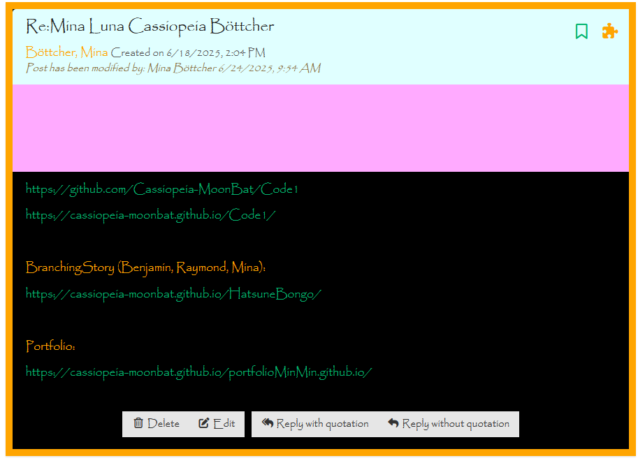

# This is a Diary or so

##GIT

### Task 01.01
How to create a markdown file. -> .md

### Task 01.02
* Repository, Commit, Branch, Remote connection
  * Repository is the workspace, the database in the background where the files are being managed in
  * Remote means the online version
  * Commit = changes
  * Branches -> parallel working
* stage, commit, fetch, pull, push, merge
  * stage -> prestep before commit
  * commit -> put change in repository
  * push -> push into Remote
  * fetch -> look for changes in remote and get it into the repository
  * pull -> getting the changes into your workpace
  * merge -> merging two commits into one
 
### Task 01.03
* exlude sth from being tracked
    * The .gitignore file tells Git which files and folders to ignore (not track).
 
* changes but want back to last commit: reset
* discarding all changes: clean
* discarding all the changes, temporarily: stash
  
* delete untracked files from local folder: clean untracked files ( right click)
* difference: merge, rebase, squash

## 16:06. wir sind am Ente

## Task 2

### Task 2.1
* HTML Hypertext Markup Language
* Tim Berners-Lee, 1991, published 1999, to enable researchers to share and link documents easily over the internet
* The first well-known public presentation of markup languages in computer text processing was made by William W. Tunnicliffe at a conference in 1967, although he preferred to call it generic coding
* Syntax is the arrangement of elements and attributes to create well-formed documents. example: Doctype declaration. 
  A semantic element clearly describes its meaning to both the browser and the developer. example: , <table>

### Task 2.2 
* The HTML DOM (Document Object Model) When a web page is loaded, the browser creates a Document Object Model of the page. The HTML DOM model is constructed as a tree of Objects:

### Task 2.4
* https://www.w3schools.com/html/default.asp
* https://webcode.tools/

## 23.06 14:44 wir sind am Ente.com

## Task 3

### Task 3.1

* CSS: Cascading Style Sheets
* 

### Task 3.2

* 1: plate
* 2: bento
* 3: #fancy
* 4: plate apple
* 5: #fancy pickle
* 6: .small
* 7: orange.small
* 8: bento orange.small
* 9: plate, bento
* 10: *
* 11: plate *
* 12: plate + apple
* 13: bento ~ pickle
* 14: plate > apple
* 15: plate :first-child
* 16: plate: only-child
* 17: #fancy :last-child, pickle
* 18: :nth-child(3)
* 19: bento:nth-last-child(3)
* 20: apple:first-of-type
* 21: plate:nth-of-type(even)
* 22: plate:nth-of-type(2n+3)
* 23: plate apple:only-of-type
* 24: .small:last-of-type
* 25: bento:empty
* 26: apple:not(.small)
* 27: \[for\]
* 28: plate\[for\]
* 29: \[for="Vitaly"\]
* 30: \[for^="Sa"\]
* 31: \[for$="ato"\]
* 32: \[for*="obb"\]

## Task 3.3

* justify-content: flex-end;
* justify-content: center;
* justify-content: space-around;
* justify-content: space-between;
* align-items: flex-end;
* justify-content: center; align-items: center;
* justify-content: space-around; align-items: flex-end;
* flex-direction: row-reverse;
* flex-direction: column;
* flex-direction: row-reverse; justify-content: flex-end;
* flex-direction: column; justify-content: flex-end;
* flex-direction: column-reverse; justify-content: space-between;
* justify-content: center; align-items: flex-end; flex-direction: row-reverse;
* order: 1;
* order: -3;
* align-self: flex-end;
* order: 2; align-self: flex-end;
* flex-wrap: wrap;
* flex-direction: column; flex-wrap: wrap;
* flex-flow: column wrap;
* align-content: flex-start;
* align-content: flex-end;
* flex-direction: column-reverse; align-content: center;
* flex-flow: column-reverse wrap-reverse; justify-content: center; align-content: space-between;

### Grid

* grid-template-columns: 50% 50%;
* grid-template-columns: 20% 40% 40%;
* grid-template-columns: repeat(4,25%);
* grid-template-columns: repeat(3,30%);
* grid-template-columns: 100px 30%;
* grid-template-columns: repeat(3, 1fr);
* grid-template-columns: repeat(4, 1fr);
* grid-template-columns: 100px repeat(3, 1fr);
* grid-template-columns: 20% 100px 1fr;
* grid-template-columns: 1fr auto 1fr;
  
* grid-template-columns: 25% 50% 25%; grid-template-rows: 100px 150px 1fr;
  
* grid-template-columns: 1fr 2fr 1fr; grid-template-rows: 1fr 2fr 1fr;
  
* grid-template-columns: 1fr 2fr 1fr; grid-template-rows: 1fr 2fr 1fr; column-gap: 15px;

* grid-template-columns: 1fr 2fr 1fr; grid-template-rows: 1fr 2fr 1fr; column-gap: 5%;

* grid-template-columns: 1fr 2fr 1fr; grid-template-rows: 1fr 2fr 1fr; row-gap: 40px;

* column-gap:10px; row-gap:15%;

* gap: 20px 20px;
  
